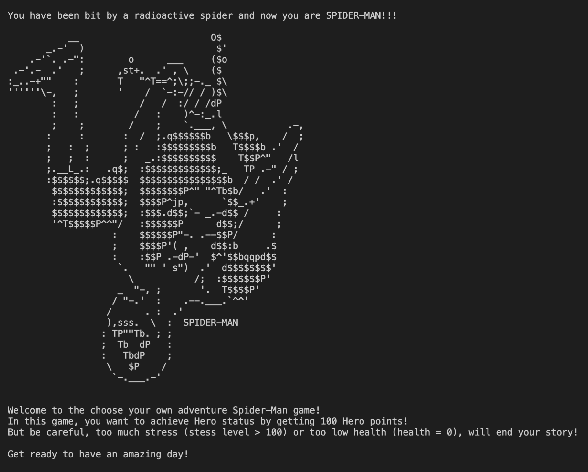
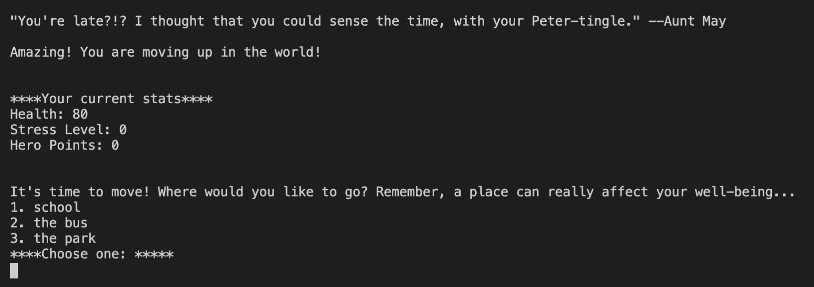

# Python-Game-Spiderman
## This is my first python project.

This project utilizes:
- importing random numbers
- classes and methods
- utilizing parameters within classes to create lists

## Game Play
In this game, you are Spider-Man and you are trying to achieve ***Hero status***! But be careful, because every choice will affect your health and stress levels. Lose all of your health or exceed your maximum stress level and you will lose!

Also, be careful! As game play continues, each choice becomes more important! 

## Avengers Unite!
Beginning Game Play

Example of a Menu and Spider-Man levels

